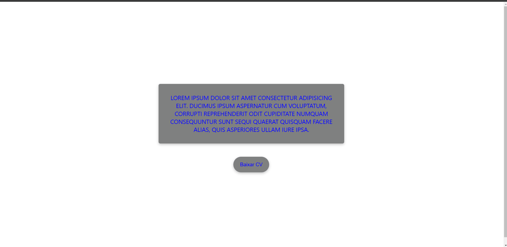

# Basic React Quest 

This is a challange proposed by DevQuest with the objective exercice React

## The challange

"Questers" should be able to test their skills by:

 - Display a colored and uppercased text using props and components in react
 - Create a button that display a alert with a massage including the button's label

 ## Screenshot

 

## Solution link

- Live server URL: [Live site at GitHub-Pages](https://viniciusmontibeller.github.io/projeto-inicial-fetch-github-api/)

## Build with

 - HTML
 - CSS
 - Javascript
 - React

## What I learned

In this project i learned some basic react skills, such as, how to work with components and to create events.

## Continued development

With this project i got understand a little of react and want to be able to use it at full capacity.

## Useful resources

 - [W3Schools](https://www.w3schools.com/)
 - [MDN Web Docs](https://developer.mozilla.org/en-US/)
 - [Dev em Dobro](https://github.com/devemdobro)

## Autor
 - Github - [viniciusmontibeller](https://github.com/viniciusmontibeller)

 ## Acknowledgments

I got to say that i'm really happy to be studying with the lessons by [Dev em Dobro](https://github.com/devemdobro). I started with zero programing skills and now i can see that i'm growing little by little into what i wanted to be.